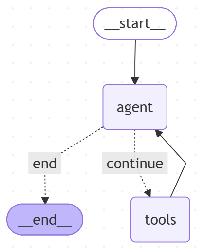

```python
import json
import os
from typing import Annotated, Sequence, TypedDict
from dotenv import load_dotenv
from langchain_core.messages import BaseMessage, ToolMessage, SystemMessage
from langchain_core.runnables import RunnableConfig
from langgraph.constants import END
from langgraph.graph import StateGraph
from langgraph.graph.message import add_messages
from langchain_openai import ChatOpenAI
from langchain_core.tools import tool

load_dotenv()

# 图状态
class AgentState(TypedDict):
    messages: Annotated[Sequence[BaseMessage], add_messages]

llm = ChatOpenAI(
    model=os.getenv("MODEL_NAME"),
    base_url=os.getenv("BASE_URL"),
    api_key=os.getenv("API_KEY"),
    timeout=30)

@tool
def get_weather(location: str) -> str:
    """Call to get the weather from a specific location."""
    if any([city in location.lower() for city in ['sf', 'san francisco']]):
        return "It's sunny in San Francisco, but you better look out if you're a a Gemini 😈."
    else:
        return f"I am not sure what the weather is in {location}."

tools = [get_weather]

model = llm.bind_tools(tools)

tools_by_name = {tool.name: tool for tool in tools}

#Define the tool node
def tool_node(state: AgentState):
    outputs = []
    for tool_call in state["messages"][-1].tool_calls:
        tool_result = tools_by_name[tool_call["name"]].invoke(tool_call["args"])
        outputs.append(
            ToolMessage(
                content=json.dumps(tool_result),
                name=tool_call["name"],
                tool_call_id=tool_call["id"],
            )
        )
    return {"messages": outputs}

# Define the node that calls the model
def call_model(state: AgentState, config: RunnableConfig):
    system_prompt = SystemMessage(
        "You are a helpful AI assistant, please respond to the users query to the best of your ability.",
    )
    response = model.invoke([system_prompt] + state["messages"], config)
    return {"messages": [response]}

# Define the conditional edge that determines whether to continue or not
def should_continue(state: AgentState):
    messages = state["messages"]
    last_message = messages[-1]
    if not last_message.tool_calls:
        return "end"
    else:
        return "continue"

# Define a new graph
workflow = StateGraph(AgentState)

# Define the two nodes we will cycle between
workflow.add_node("agent", call_model)
workflow.add_node("tools", tool_node)

# Set the entrypoint as 'agent'
workflow.set_entry_point("agent")

# Add a conditional edge
workflow.add_conditional_edges(
    "agent",
    should_continue,
    {
        "continue": "tools",
        "end": END,
    },
)

# Add a normal edge from 'tools' to 'agent'
workflow.add_edge("tools", "agent")
graph = workflow.compile()

print(graph.get_graph().draw_mermaid())

def print_stream(stream):
    for s in stream:
        message = s["messages"][-1]
        if isinstance(message, tuple):
            print(message)
        else:
            message.pretty_print()

while True:
    user_megs = input("\nuser: ").strip()
    if user_megs == "quit":
        break
    inputs = {"messages": [("user", user_megs)]}
    print_stream(graph.stream(inputs, stream_mode="values"))
```

<div align="center">
   
    <p>LangGraph 流程图</p>
</div>
